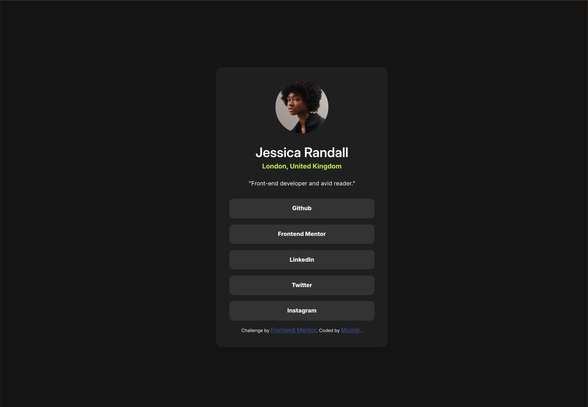

# Frontend Mentor - Social links profile solution

This is a solution to the [Social links profile challenge on Frontend Mentor](https://www.frontendmentor.io/challenges/social-links-profile-UG32l9m6dQ). Frontend Mentor challenges help you improve your coding skills by building realistic projects. 

## Table of contents

- [Overview](#overview)
  - [The challenge](#the-challenge)
  - [Screenshot](#screenshot)
  - [Links](#links)
- [My process](#my-process)
  - [Built with](#built-with)
  - [What I learned](#what-i-learned)
  - [Continued development](#continued-development)
- [Author](#author)
## Overview

### The challenge

Users should be able to:

- See hover and focus states for all interactive elements on the page

### Screenshot

Frontend Mentor's Desktop Design



### Links

- Solution URL: [My solutionto this challenge](https://social-links-profile-challenge-moonji.netlify.app/)

## My process
### Built with

- Semantic HTML5 markup
- CSS custom properties
- Flexbox
- CSS Grid

### What I learned

I learned/experimented with three different ways to make the links/buttons but I don't know which way would be the best or most optimal option.

```html
<!-- USING ANCHOR ELEMENT FOR BUTTONS -->
    <a href="" class="button"> Github </a>
    <a href="" class="button"> Frontend Mentor </a>
    <a href="" class="button"> LinkedIn </a>
    <a href="" class="button"> Twitter </a>
    <a href="" class="button"> Instagram </a>
    
    <!-- USING BUTTON ELEMENT INSTEAD OF ANCHOR -->
    <button href=""> Github </button>
    <button href=""> Frontend Mentor </button>
    <button href=""> LinkedIn </button>
    <button href=""> Twitter </button>
    <button href=""> Instagram </button> 

    <!-- USING DIVS INSTEAD OF BUTOTNS OR ANCHORS! -->
    <div href="" class="button"> Github </div>
    <div href="" class="button"> Frontend Mentor </div>
    <div href="" class="button"> LinkedIn </div>
    <div href="" class="button"> Twitter </div>
    <div href="" class="button"> Instagram </div>   
```

### Continued development

Something I would like to learn and try soon is how to use/access the fonts files in the assets folder instead of importing to CSS or linking to the Google Fonts page.

## Author

- Frontend Mentor - [@moonji-spoonji](https://www.frontendmentor.io/profile/moonji-spoonji)
